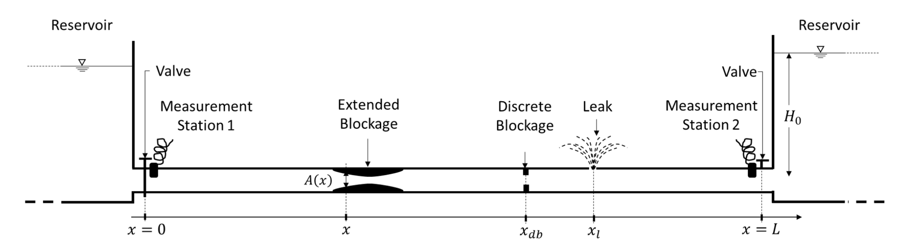

# Hydraulic Transient MOC for Pipe with Multiple Defects

🚰 A MATLAB function for solving 1D water hammer equations in pipes with complex defect profiles using the Method of Characteristics (MOC).

## 📌 Overview

This repository provides a highly vectorized MATLAB implementation of the Method of Characteristics (MOC) to simulate hydraulic transients in pipes with multiple defects. It solves the 1D water hammer partial differential equations for pressure and flow over space and time, accommodating:

- 🔧 **Leakages** (any number, any location)
- 🚧 **Discrete blockages** (any number, any location)
- 🌀 **Extended blockages** with generic shapes

The function is designed to be general, fast, and scalable by avoiding loops through vectorization. Defects are handled by modifying node definitions along the positive and negative characteristic lines, enabling accurate modeling of complex pipe conditions.



## ⚙️ Features

- ✅ Solves transient flow in pipes with arbitrary defect configurations
- 🚀 Fully vectorized for speed and generality
- 📐 Supports any number of leaks and blockages
- 📘 Based on the methodology described in Appendix E of [Fedi Zouari's PhD Thesis](#citation)
- 🔍 Compatible with inverse modeling techniques for defect reconstruction

## 📖 Usage

1. Define your pipe geometry, boundary conditions, and defect locations.
2. Call the `solve_transient_moc_pipe_with_defects` function with appropriate parameters.
3. Analyze the output pressure and flow fields over space and time.

## 🧠 Background

The vectorization logic and defect modeling approach are detailed in Appendix E of my PhD thesis. If you use this code in your research or publications, please cite the following:

### 📚 Citation

```bibtex
@phdthesis{zouari2019internal,
  title={Internal pipe imaging for defect detection using acoustic waves},
  author={Zouari, Fedi},
  year={2019},
  school={Hong Kong University of Science and Technology}
}
```

## 🔍 Related Work

This repository builds on a body of research focused on hydraulic transients, defect detection, and inverse modeling in pipe networks. For deeper insights into the theoretical foundations and complementary algorithms, refer to the following publications:

- **Blockage Detection in Networks: The Area Reconstruction Method**  
  *Emilia Blåsten, Fedi Zouari, Moez Louati, Mohamed S. Ghidaoui*  
  Presents a reconstructive algorithm for estimating pipe cross-sectional area from boundary measurements in tree-like networks using time reversal boundary control.  
  [arXiv:1909.05497](https://arxiv.org/abs/1909.05497)

- **Transformation Between Damped and Undamped Waterhammer Waves**  
  *Fedi Zouari, Saber Nasraoui, Moez Louati, Mohamed S. Ghidaoui*  
  Derives a mathematical relation to transform measured damped pressure signals into undamped ones, improving the accuracy of inverse methods and defect imaging.  
  [ScienceDirect](https://www.sciencedirect.com/science/article/abs/pii/S0022460X20305368)

- **Inverse Transient Analysis for Pipe Defect Detection**  
  *Fedi Zouari et al.*  
  Explores inverse modeling techniques for identifying pipe defects using transient pressure signals.  
  [ASCE Library](https://ascelibrary.org/doi/abs/10.1061/%28ASCE%29HY.1943-7900.0001602)

- **Advanced Inverse Methods for Internal Pipe Imaging**  
  *Fedi Zouari et al.*  
  Discusses enhanced algorithms for reconstructing internal pipe geometry from limited measurements.  
  [ASCE Library](https://ascelibrary.org/doi/abs/10.1061/(ASCE)HY.1943-7900.0001674)

These works provide theoretical and practical context for the algorithms implemented in this repository and are recommended for users interested in extending or adapting the code for advanced applications.

## 📬 Contact

For questions, collaborations, or feedback, feel free to reach out via GitHub or connect through [LinkedIn](https://www.linkedin.com/in/zouari-fedi/).


## 🤝 Contributing

Contributions are warmly welcomed! Whether you're fixing bugs, improving performance, adding new features, or enhancing documentation, your input helps make this project better for everyone.

### 🛠 How to Contribute

1. **Fork the repository** and clone it locally.
2. **Create a new branch** for your feature or fix:
   ```bash
   git checkout -b feature-name
   ```
3. **Make your changes** and ensure the code runs correctly.
4. **Add tests** if applicable.
5. **Commit and push** your changes:
   ```bash
   git commit -m "Add feature/fix"
   git push origin feature-name
   ```
6. **Open a pull request** describing your changes and why they should be merged.

### 📋 Guidelines

- Keep code clean.
- Follow best practices and naming conventions.
- Be respectful and constructive in discussions.

### 💡 Ideas Welcome

If you have suggestions for improvements or new features, feel free to open an issue or start a discussion. Let's build something great together!
